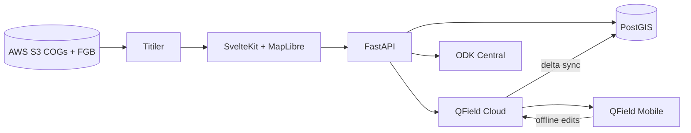

# Water Security Tool (DDA)

A watershed-first toolkit for diagnosing field conditions, designing interventions, and
assessing outcomes. AWS COG / FlatGeobuf base layers → SvelteKit web map → PostGIS vector
storage → QField offline sync → ODK Central monitoring.

The product is organized into three modules, each with its own data and API namespace:

| Module | Status | Description |
|--------|--------|-------------|
| **Diagnose** | Available | Map watersheds, secondary COG/vector layers, watershed analysis, 3D DEM draping, observation zones, hypotheses, field notes, QField offline sync |
| **Design** | Boilerplate | Plan and design interventions on top of diagnosed watersheds |
| **Assess** | Partial | Sync ODK Central projects, browse forms and submissions in the web UI |

## Architecture



| Component | Role |
|-----------|------|
| **S3 + Titiler** | Serve COG rasters as map tiles; FlatGeobufs for secondary vectors and watersheds |
| **SvelteKit** | Landing page + Diagnose / Design / Assess UIs (MapLibre 2D + Plotly 3D in Diagnose) |
| **PostGIS** | Diagnose projects, observation zones, hypotheses, field notes; Assess project rows synced from ODK |
| **QField Cloud** | Package a diagnosis for mobile; sync offline edits back to PostGIS |
| **ODK Central** | Source of Assess monitoring projects, forms, and submissions |

## Repository structure

```
geo-field-pipeline/
├── backend/
│   ├── app/
│   │   ├── main.py                 # Router registration, CORS
│   │   ├── shared/                 # Config, DB, S3, auth, access, ODK client
│   │   └── modules/
│   │       ├── accounts/           # Auth, users, orgs, QField / ODK connectors
│   │       ├── diagnose/           # Projects, layers, analysis, 3D drape, QField
│   │       │   └── config/         # layers.yaml — styling + analysis catalog
│   │       ├── design/             # Boilerplate (/api/design)
│   │       └── assess/             # ODK project sync + forms/submissions
│   ├── db/init.sql                 # PostGIS schema
│   ├── scripts/
│   │   ├── run_tests.sh            # Pytest inside the API container
│   │   └── prepare_secondary_layers.sh
│   ├── tests/                      # Unit / API smoke tests
│   ├── docker-compose.yml          # PostGIS, Titiler, API
│   └── Dockerfile
├── docs/                           # Module + setup + API docs
└── frontend/                       # SvelteKit + MapLibre + Plotly
    └── src/
        ├── routes/(protected)/
        │   ├── diagnose/           # Project picker + map + members
        │   ├── design/             # Boilerplate page
        │   └── assess/             # ODK projects → forms → submissions
        └── lib/modules/
            ├── diagnose/           # MapView, Terrain3DView, API client
            ├── design/
            └── assess/             # AssessProjects / Forms / Submissions
```

## Quick start

### 1. Configure environment

```bash
cd backend
cp .env.example .env
# Edit .env with AWS credentials, S3 bucket, COG_LAYERS, VECTOR_LAYERS, watersheds key,
# QField Cloud settings, and optional ODK Central credentials
```

Get a QField Cloud token at [app.qfield.cloud/user/settings](https://app.qfield.cloud/user/settings/).

### 2. Start backend services

```bash
cd backend
docker compose up -d
```

This starts:
- **PostGIS** on `localhost:5432` (database `dda_product`)
- **Titiler** on `localhost:8000` (reads COGs from S3)
- **API** on `localhost:8080`

### 3. Start frontend

```bash
cd frontend && npm run dev
```

Open [http://localhost:5173](http://localhost:5173).

**API proxying:** In development, browser requests to `/api/*` are forwarded to FastAPI
(`localhost:8080`) by the SvelteKit catch-all at `frontend/src/routes/api/[...path]/+server.js`.
Vite's `server.proxy` is only used for `/titiler`.

### 4. Run backend tests (optional)

```bash
cd backend
bash scripts/run_tests.sh
```

## Usage (Diagnose)

### Projects

1. Open `/diagnose` — existing projects or **New project**
2. Enter a name and click the map to set a location
3. The app looks up the watershed from the configured FlatGeobuf/GPKG on S3
4. The map opens at `/diagnose/{project-slug}` zoomed to that watershed

### Web map (inside a project)

- **2D / 3D toggle** — MapLibre map or Plotly DEM terrain with secondary layers draped on the surface
- **Secondary layers** — COGs (LULC, DEM, JRC water) and vectors (aquifers, WISER stress/resilience, villages) from `COG_LAYERS` / `VECTOR_LAYERS`, styled via `layers.yaml`
- **Watershed analysis** — per-layer meaning, uncertainty, field checks, and zonal stats for the active watershed
- **Observation zones** — draw polygons with label, observations, questions, color
- **Hypotheses** — link zones, collect field-note evidence, validate / invalidate
- **Field notes** — geotagged points with optional photo/audio and hypothesis link
- **Package to QField** — watershed-clipped rasters (MBTiles) + project vectors to QField Cloud

### QField mobile

1. Sign in to QField Cloud in the QField app
2. Download the project (named `{QFIELD_PROJECT_NAME}-{your-project-name}`)
3. Edit observation zones and field notes offline
4. Sync when back online — deltas apply to PostGIS

## Usage (Assess)

1. Connect ODK Central credentials (Settings / connectors, or env `ODK_*` for server-side sync)
2. Open `/assess` and **Import** projects from ODK Central
3. Drill into forms and submissions for a synced project

## PostGIS schema (high level)

**diagnosis** — name, watershed, seed coordinates, QField Cloud ids  
**observation_zones** / **hypotheses** / **field_notes** — Diagnose field data  
**assess_projects** — ODK-synced Assess work areas (`odk_project_id`, status)  
**users** / **organizations** / **sessions** — accounts and sharing

See [docs/database.md](docs/database.md) for the full schema.

## Important: PostGIS must be reachable from QField

For offline sync, QField Cloud must reach the host in `POSTGIS_PUBLIC_HOST` (not `localhost`).
For local development, use a tunnel (ngrok, Cloudflare Tunnel) or a cloud VM.

## API (summary)

### Diagnose (`/api/diagnose/...`)

| Area | Examples |
|------|----------|
| Projects | `GET/POST /projects`, access grants under `/projects/{id}/access` |
| Layers | `/layers/cog`, `/layers/vector`, tile proxy, `/layers/dem/mesh`, `/{id}/drape-grid` |
| Analysis | `/layers/analysis/batch`, `/layers/cog|vector/{id}/analysis` |
| Field data | observation-zones, field-notes, hypotheses |
| QField | `/qfield/package`, `/qfield/sync` (+ SSE variants) |

### Assess (`/api/assess/...`)

| Method | Path | Description |
|--------|------|-------------|
| GET | `/status` | Module status placeholder |
| GET | `/odk/projects` | Sync/list ODK Central projects into `assess_projects` |
| GET | `/projects` | List synced Assess projects |
| GET | `/projects/{id}/forms` | List forms |
| GET | `/projects/{id}/forms/{form}/submissions` | List submissions |
| GET | `/projects/{id}/forms/{form}/submissions/{iid}` | Single submission |

### Design

| Method | Path | Description |
|--------|------|-------------|
| GET | `/api/design/status` | Placeholder |

Full reference: [docs/api.md](docs/api.md).

## Documentation

| Doc | Contents |
|-----|----------|
| [docs/setup.md](docs/setup.md) | Environment, Docker, S3 layout, tests |
| [docs/diagnosis.md](docs/diagnosis.md) | Diagnose capabilities, layers, 3D, QField, access |
| [docs/assess.md](docs/assess.md) | Assess / ODK status |
| [docs/settings.md](docs/settings.md) | Settings, organizations, connector workflows |
| [docs/design.md](docs/design.md) | Design placeholder |
| [docs/database.md](docs/database.md) | Schema |
| [docs/api.md](docs/api.md) | Endpoint reference |

## Next steps

- Complete Design module data models and UI
- Finish Assess Metabase embed (config keys exist; router still to land)
- Production deploy (HTTPS, reverse proxy for `/api`, public PostGIS for QField)
